# Ultimate Improvements

Mods, coremods and Bukkit plugins written for **The Favoured Craft**, a Minecraft **1.4.7** server
running the *FTB Ultimate / Ultimate Remastered* pack on **MCPC+** (Forge `1.4.7-6.6.2.534` + Bukkit)
with TickThreading. Everything here is built with modern tooling against that 2013 runtime: Forge
mods and coremods use [Voldeloom](https://github.com/CrackedPolishedBlackstoneBricksMC/voldeloom),
Bukkit plugins compile straight against the MCPC+ server jar.

Each folder has its own README with usage, config and (where there is something to look at) a
screenshot. The tables below say where a jar goes: `mods/` (Forge mod), `coremods/` (FML coremod
with ASM transformers), `plugins/` (Bukkit plugin) or client-only.

## Gameplay mods — `mods/` on both server and clients

| | Mod | What it does |
|---|---|---|
| 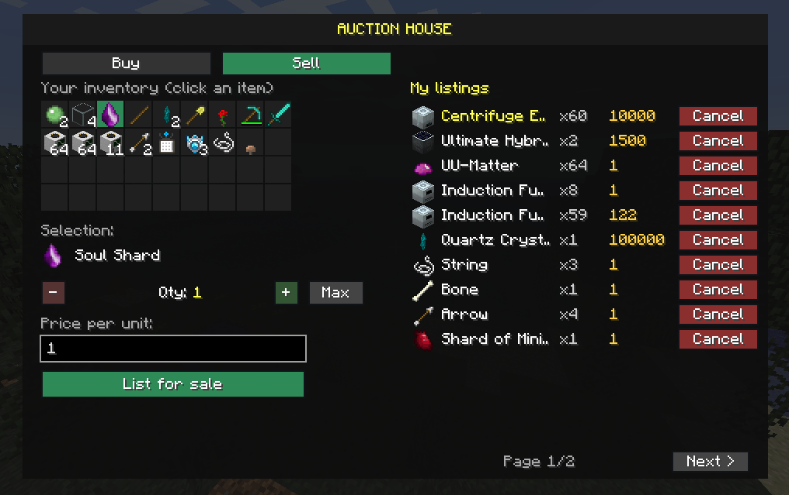 | [`hdv/`](hdv/) | **Hotel de Vente** — player auction house with a custom GUI (**H** or `/hdv`), paid with the Essentials economy. Server-authoritative buy / sell / cancel, listings persisted in world data. |
| 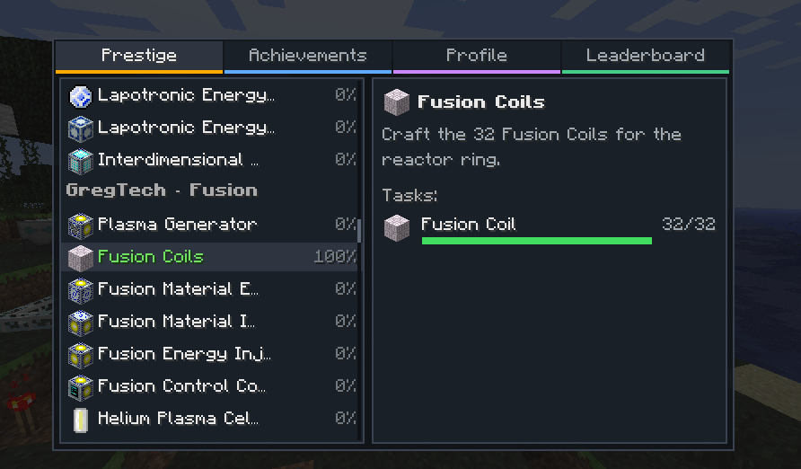 | [`questcycle/`](questcycle/) | Config-driven quests with a prestige cycle, titles, achievements and a leaderboard (**Q**). |
| 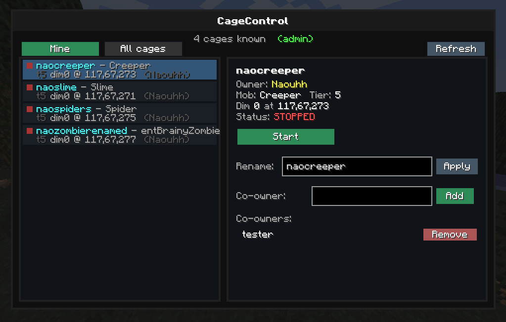 | [`cagecontrol/`](cagecontrol/) | Soul Shards cages stop auto-spawning: name a cage with its shard, start / stop it from the **K** menu or `/shard`, add co-owners. Repairs dropped shards (wither flag, exact kill count). |
| 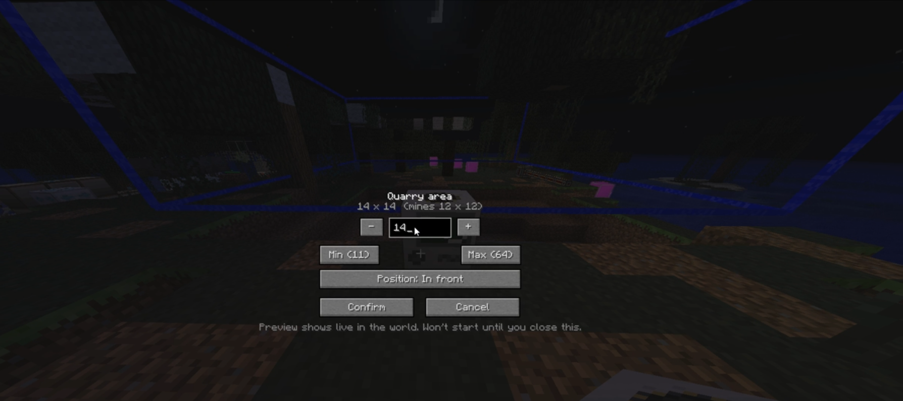 | [`quarryrange/`](quarryrange/) | Placing a BuildCraft Quarry opens an area editor (size, position, live laser preview); the quarry stays idle until you confirm. |
| 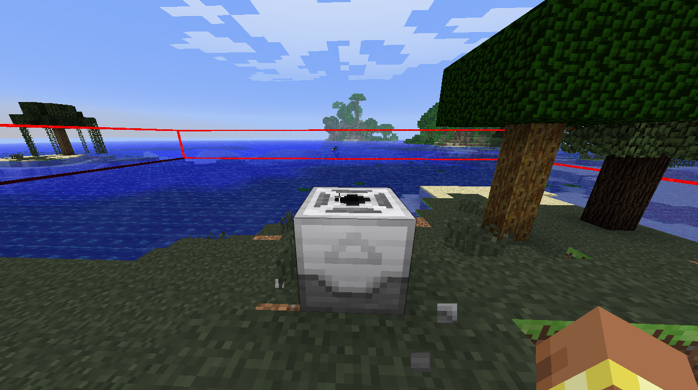 | [`mfrzone/`](mfrzone/) | Sneak + left-click a MineFactory Reloaded Planter / Harvester / Fertilizer to flash its working area (radius upgrade included) as a laser box. |
| 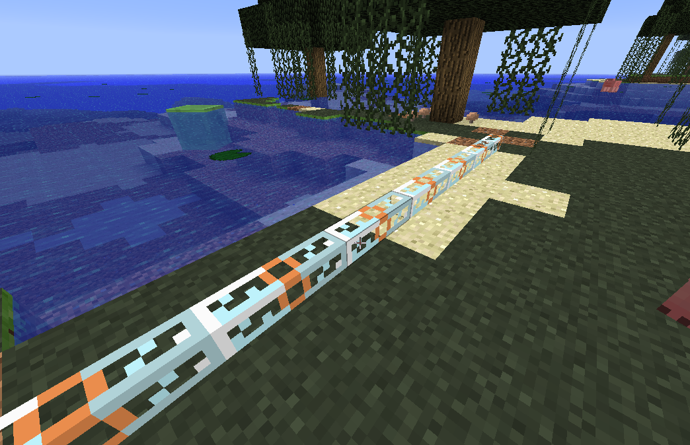 | [`paintbrush/`](paintbrush/) | A reusable Paint Brush to colour IndustrialCraft 2 cables; sneak + right-click cycles the 16 dyes. |
| 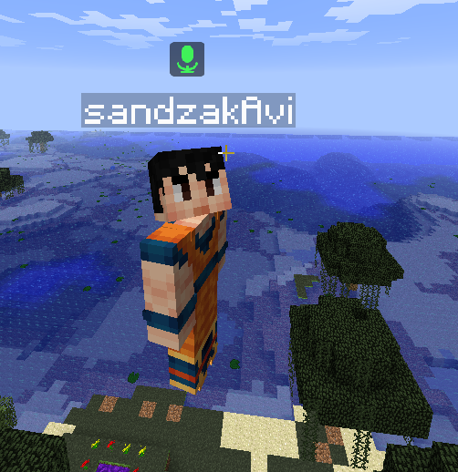 | [`voicechat/`](voicechat/) | Proximity voice chat (**V** push-to-talk) carried over the normal Minecraft connection — no extra port to open. |
| 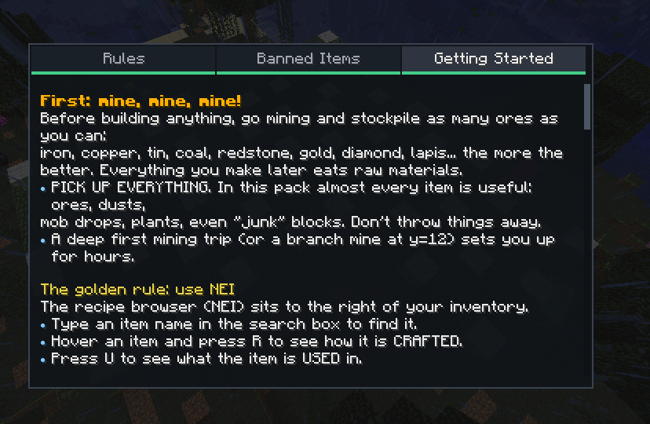 | [`serverguide/`](serverguide/) | In-game guide book: rules, banned items and a getting-started tutorial (**G** or `/guide`). |
| | [`neiae/`](neiae/) | Wires NEI's `?` recipe button to the AE ME Crafting Terminal: the ingredients are pulled from the ME network into the crafting grid. |
| | [`translocator/`](translocator/) | 1.4.7 backport of ChickenBones' Translocator 1.1.0.2 (item / liquid translocators, crafting grid). |

## Client-only mods — `mods/` on the client

| | Mod | What it does |
|---|---|---|
| | [`mousetweaksng/`](mousetweaksng/) | Clean rewrite of Mouse Tweaks (drag to distribute, merge, sweep) that paces its clicks so 1.4.7's one-at-a-time window transactions keep up — no more "items don't show until you click again". |
| 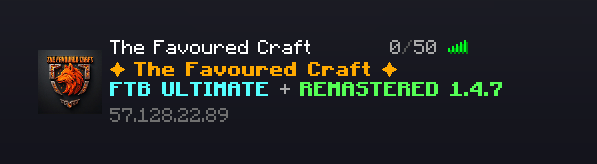 | [`favouredserverlist/`](favouredserverlist/) | Custom multiplayer screen with the server pre-listed, a bundled icon and a two-line coloured MOTD. |
| 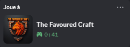 | [`discordrpc/`](discordrpc/) | Discord Rich Presence through the local Discord IPC pipe: pack name, icon, time played, player count. |

## Coremods — `coremods/` on both sides

| | Coremod | What it does |
|---|---|---|
| 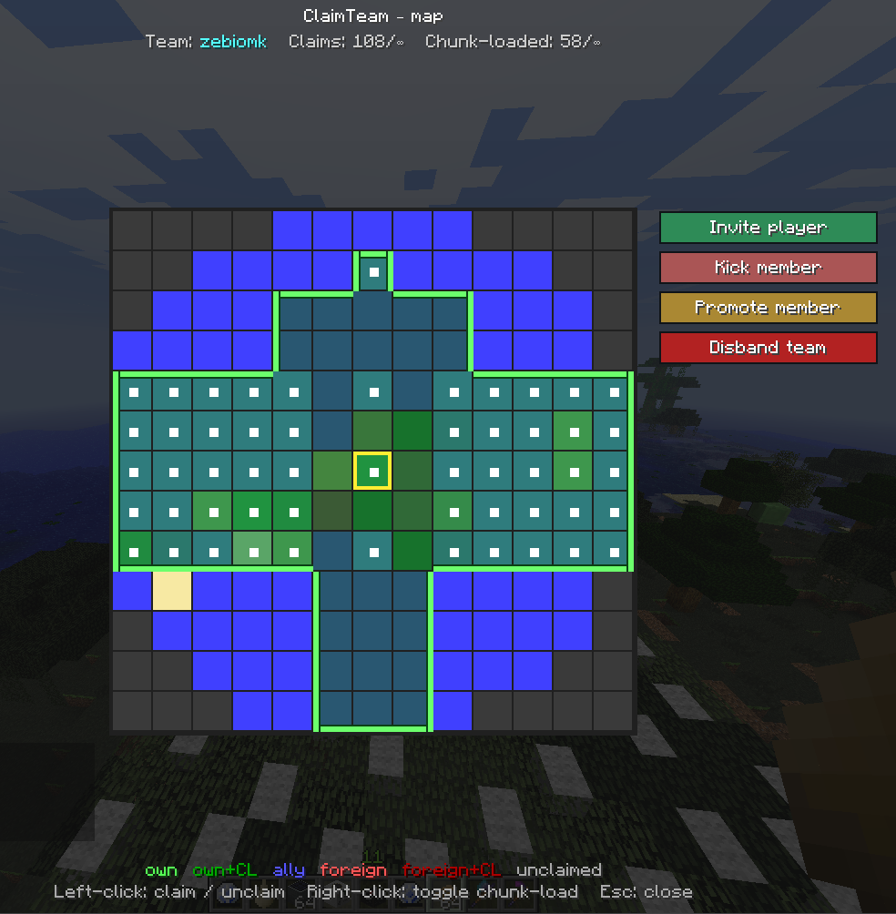 | [`claimteam/`](claimteam/) | Chunk claims, teams (owner / member / ally) and chunk loading from a grid map (**C**), `/claim` and `/team`. ASM patches on explosions, pistons, fluids, PvP, quarries and turtles enforce claim boundaries. |
| 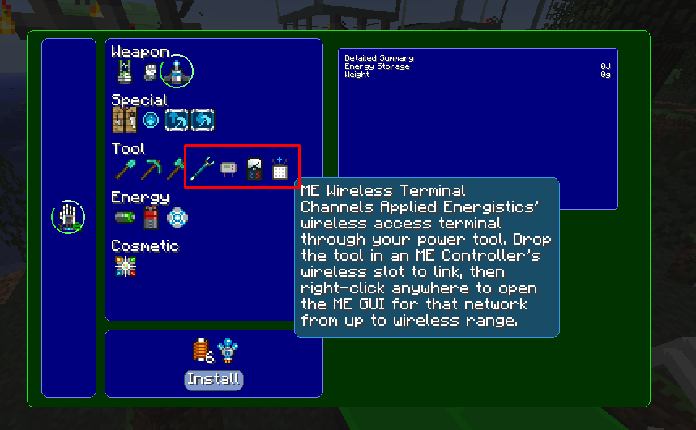 | [`mps-nao-addons/`](mps-nao-addons/) | Modular Powersuits add-ons: Flight Control ground-feel fix, Air Stride, OmniWrench, EU Reader, TE Multimeter and ME Wireless Terminal modules, plus the fix for MPS stamping an NBT tag on every item (which broke stacking). |
| 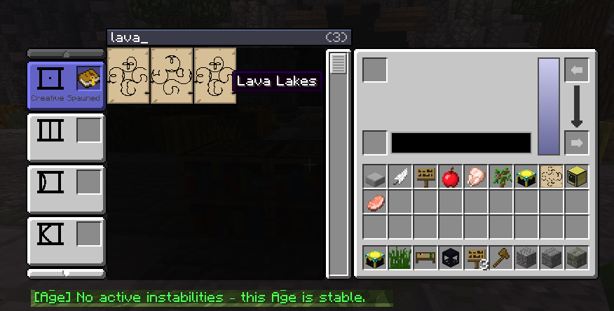 | [`mystutils/`](mystutils/) | Mystcraft helpers: `/instabilities` and a search bar in the Writing Desk. |
| | [`tfcfixes/`](tfcfixes/) | Bundle of independent, fail-safe ASM fixes: Mystcraft desk worldgen spam, IC2 / AdvancedMachines / GregTech `ClassCastException`s, the post-teleport TileEntity-sync crash, AE deadlocks under TickThreading, and a server-side window-click resync. Absorbs `ic2netfix` and `windowitemsfix`. |
| | [`crackauthcore/`](crackauthcore/) | Server-only companion of the CrackAuth plugin: blocks inbound mod packets until the player has logged in, so mod keybinds can't act before authentication. |
| | [`mpsflightfix/`](mpsflightfix/) | Original standalone Flight Control fix as a NilLoader nilmod. **Superseded by `mps-nao-addons`** — run only one of the two. |
| | [`ic2netfix/`](ic2netfix/), [`windowitemsfix/`](windowitemsfix/) | Earlier standalone coremods, now merged into `tfcfixes`. Kept for history. |
| | [`bedcraftfixes147/`](bedcraftfixes147/) | Git submodule: fork of ThePixelbrain's BedcraftFixes147 nilmod (`nilmods/`). |

## Bukkit plugins — `plugins/` on the MCPC+ server

| | Plugin | What it does |
|---|---|---|
| 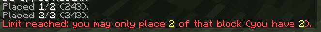 | [`itemguard/`](itemguard/) | Item blacklist by ID (optionally per world) and per-group caps on how many of a block a player may place. |
| 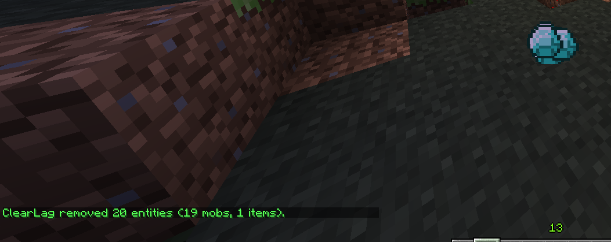 | [`clearlag/`](clearlag/) | Entity cleaner rewrite: clears hostile mobs and junk on a timer, keeps animals and items near players, TPS check. |
| 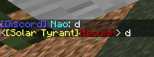 | [`discordbridge/`](discordbridge/) | Two-way chat bridge between the server and a Discord channel, REST only (no websocket library). |
| | [`crackauth/`](crackauth/) | Offline-mode login: `/register` and `/login` with hashed passwords; unauthenticated players are frozen, not stripped. |
| | [`worldbackup/`](worldbackup/) | Scheduled zip backups of every world, done off the main thread so TickThreading doesn't stall. |
| | [`automessages/`](automessages/) | Timed chat announcements with a per-player opt-out. |
| | [`randomtp/`](randomtp/) | `/rtp` random surface teleport with a cooldown. |
| | [`worldtps/`](worldtps/) | `/tps` replacement: global TPS / MSPT plus a per-world load breakdown. |
| | [`bukkittemplate/`](bukkittemplate/) | Starter project for a new MCPC+ 1.4.7 plugin. |

## Tools and documentation

| | Folder | What it is |
|---|---|---|
| 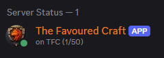 | [`discord-mc-status/`](discord-mc-status/) | Python Discord bot that shows the server's status and player count in its presence. |
| | [`docs/dartcraft/`](docs/dartcraft/) | Player wiki for DartCraft Beta 0.1.10: items, blocks, Force Engine fuels, the Force Infusion table and integration recipes. |

## Building

Every folder is its own Gradle project:

```bash
cd <folder>
./gradlew build
```

- **Forge mods and coremods** compile against MCP names and are remapped to 1.4.7's obfuscated
  names by Voldeloom (a Gradle-provisioned JDK 11 does the compiling, the output targets Java 6).
  Everything that reaches into another mod (IC2, AE, BuildCraft, MPS, Soul Shards, Mystcraft, MFR…)
  does so by reflection or ASM at runtime, so most projects need no third-party jar at all.
- **Bukkit plugins** use `compileOnly files("<server>/mcpc-plus.jar")` because the 2013 Bukkit Maven
  repositories are gone; point `serverDir` in their `build.gradle` at a copy of the server.
- Most build scripts end with an install task that copies the jar into the dev client instance
  and the pack's staging folder. Adjust or remove the paths for your setup.

### Third-party jars (`libs/`, git-ignored)

| Project | Needs in `libs/` |
|---|---|
| `cagecontrol` | `SoulShards.jar` |
| `mps-nao-addons`, `mpsflightfix` | `ModularPowersuits.jar` (0.3.2-199 era) |
| `paintbrush` | `ic2api.jar` — just `ic2/api/IPaintableBlock.class` extracted from `IC2.jar` |
| `translocator` | `CodeChickenCore-0.8.1.6.jar` (via `modCompileOnly`, remapped like our own code) |
| `bedcraftfixes147` | see its README (`libs/pack/`) |
| everything else | nothing — reflection / ASM only |

All of these can be extracted from any 1.4.7 pack that ships the upstream mod (FTB Ultimate has them).

## Deploying to the pack

The pack itself (packwiz + unsup) is not in this repository. A rebuilt jar only reaches players
once it is in the pack's staging folder, the packwiz index is regenerated and signed, the files are
uploaded, and the server (for anything that runs server-side) is restarted with the new jar in
place. Dropping a jar into an unsup-managed client instance by hand does not work: unsup restores
the indexed version next to it and FML refuses to start with the mod id twice.

## License

The original work in this repository is released under the **MIT License** — see [`LICENSE`](LICENSE).

[`translocator/`](translocator/) is a backport of ChickenBones' Translocator 1.1.0.2 (originally
distributed alongside CodeChickenCore, which is MIT) and the upstream code remains governed by that
licence. [`bedcraftfixes147/`](bedcraftfixes147/) is a submodule of
[ThePixelbrain/BedcraftFixes147](https://github.com/ThePixelbrain/BedcraftFixes147) and keeps its
own licence.
