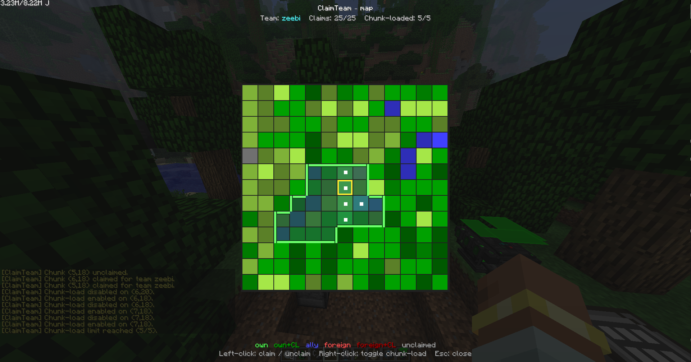

# ClaimTeam (alpha)

A chunk-claim, team, and chunk-loading mod for **MC 1.4.7 / Forge `1.4.7-6.6.2.534`**
(FTB Ultimate / Ultimate Remastered era), built with
[Voldeloom](https://github.com/CrackedPolishedBlackstoneBricksMC/voldeloom).

Inspired by FTB Chunks + FTB Teams, adapted to the 1.4.7 modding constraints (no
`BlockEvent.BreakEvent`, no `ExplosionEvent`, no UUIDs — everything by username).



## What it does

- Claim chunks for your team — visual grid map (key `C` by default, rebindable in
  Controls → `ClaimTeam Map`) and `/claim` / `/unclaim` commands.
- Chunk-load any claim — right-click on the map, or `/chunkload`. Forced **always on**
  via `ForgeChunkManager` `NORMAL` tickets, even when no team member is online.
- Teams with fixed roles: **owner** (full control), **member** (build inside team
  claims), **ally** (interact / open containers, no break).
- Per-group max claims & max chunk-loads. Groups come from
  [Essentials GroupManager](https://dev.bukkit.org/projects/essentialsx)
  by reflection if it's present (MCPC+ / Cauldron servers), with a config-file
  fallback otherwise.
- ASM-level protection layer for griefing vectors that 1.4.7 Forge events can't reach:
  TNT/creeper explosions, piston pushes, fluid flow, and PVP.

## Installation

Drop `claimteam-0.1.0.jar` into the `coremods/` folder (not `mods/`) of a 1.4.7
Forge profile. No external dependencies. Both client and server need the jar
(`@NetworkMod(clientSideRequired = true, serverSideRequired = true)`).

## Usage

### Map GUI

Press the bound key (default `C`, rebindable in Controls — search for `ClaimTeam Map`):

- **Left-click** an unclaimed chunk to claim it for your team.
- **Left-click** a chunk you own to unclaim it.
- **Right-click** an owned chunk to toggle chunk-load (white dot = active).
- **Esc** to close.

The map shows live terrain colors (vanilla `MapColor` of the top block per chunk,
with relief shading based on height delta), claim ownership tinted on top, and
FTB Chunks-style merged borders around adjacent same-team chunks.

### Commands

| Command | Effect |
|---|---|
| `/claim` | Claim the chunk you're standing in. |
| `/unclaim` | Unclaim the chunk you're standing in. |
| `/chunkload` | Toggle chunk-load on your current chunk. |
| `/team create <name>` | Create a team you own. |
| `/team invite <player>` | Add a member. |
| `/team kick <player>` | Remove a member. |
| `/team ally <player>` | Mark a player as ally (read-only access). |
| `/team unally <player>` | Drop an ally. |
| `/team leave` | Leave your current team (owners can't, use `disband`). |
| `/team disband` | Owner-only: delete the team and release all its claims. |
| `/team info` | Members, allies, claim counts. |
| `/team list` | List all teams on the server. |
| `/claimadmin reload` | Reload `claimteam.cfg` (op-only). |
| `/claimadmin setgroup <player> <group>` | Memory-only group override (op-only). |
| `/claimadmin wipe <team>` | Force-remove a team and its claims (op-only). |
| `/claimadmin info` | Show config state, GroupManager bridge status, transformer toggles. |
| `/claimadmin gm <player>` | Lookup a player's GroupManager group. |

### Config — `config/ClaimTeam.cfg`

Per-group limits. Edit then `/claimadmin reload`:

```
[groupLimits]
    Default.maxClaims=25
    Default.maxChunkloads=5
    Builder.maxClaims=50
    Builder.maxChunkloads=15
    Moderator.maxClaims=200
    Moderator.maxChunkloads=50
    Admin.maxClaims=-1            # -1 = unlimited
    Admin.maxChunkloads=-1

[general]
    useGroupManager=true          # auto-detected; falls back to [playerGroups] if absent

[playerGroups]
    # username=groupName — used only when GroupManager isn't on the classpath
    Naouh=Admin

[transformers]
    explosion=true                # kill switch per ASM transformer (requires restart)
    piston=true
    fluid=true
    pvp=true

[gui]
    gridRadius=6                  # half-width of the map grid (6 → 13x13 chunks shown)
```

## Status — what's tested vs what isn't

This is an **alpha**. Confirmed working in-game on Ultimate Remastered (client + integrated server):

- ✅ Team create / invite / kick / ally / leave / disband / info / list
- ✅ Claim / unclaim via map GUI and `/claim`
- ✅ Chunk-load toggle, persistence across server restarts (re-attached at server start via
  `ForgeChunkManager.LoadingCallback` + `rebuildFromRegistry` fallback)
- ✅ Group limits enforcement (`25/25 claims, 5/5 chunk-loaded` cap shown in screenshot)
- ✅ Map GUI rendering with terrain, relief shading, merged borders, chunk-load markers
- ✅ Keybind persistence (description `ClaimTeam Map` has no `:` so `options.txt` round-trips)
- ✅ All four ASM transformers patch successfully at boot:
  `Explosion.doExplosionB`, `BlockPistonBase.tryExtend`, `BlockFlowing.updateTick`,
  `EntityPlayer.attackTargetEntityWithCurrentItem` — log lines `[ClaimTeam] Patched ...` confirm
- ✅ Direct interaction protection via `PlayerInteractEvent` (`LEFT_CLICK_BLOCK` block-break
  cancel, `RIGHT_CLICK_BLOCK` place / container-open cancel)

Still needs end-to-end gameplay testing:

- ⏳ **TNT / creeper / wither explosions** — the transformer patches the method, but actual
  in-world test that the affected-blocks list is correctly filtered hasn't been run.
- ⏳ **Pistons** — verify a piston outside a claim cannot push blocks into one (and that
  pistons inside the claim work normally).
- ⏳ **Fluid flow** — verify lava/water can't flow across a claim boundary from an unclaimed
  chunk.
- ⏳ **PVP** — verify a non-member can't hit a member inside their claim, and that PVP
  outside claims still works.
- ⏳ **Block placement protection** — confirmed cancelled via `RIGHT_CLICK_BLOCK`, but the
  current implementation uses the looser "interact" check (allies allowed). FTB Chunks
  separates place vs. interact more strictly; we might tighten this later.
- ⏳ **GroupManager bridge** — only callable from MCPC+ / Cauldron 1.4.7. Untested because
  the local instance is Forge-only.

If a transformer's class isn't found at runtime, the boot log shows
`[ClaimTeam] <feature> not found in <className>` and the mod continues without that
protection layer — claim/team/chunkload still work.

## Known limitations

- 1.4.7 has no `BlockEvent.BreakEvent` / `BlockEvent.PlaceEvent` / `ExplosionEvent` /
  `AttackEntityEvent`. We fill the gaps with ASM, but some indirect grief vectors aren't
  covered yet: sand/gravel landing in claims from outside, mob spawning in/near claims,
  dispensers shooting items across boundaries, end portals, dragon. These are out of
  scope for the alpha.
- Player identity is the case-insensitive username (no UUIDs in 1.4.7). Renaming a
  player invalidates their team membership.
- The map GUI is a snapshot — it doesn't refresh while open. Reopen it after moving.
- One single dimension's team registry is shared across dims for the overworld; nether /
  end claims are per-dim and don't share counts. (Worth revisiting if it becomes a
  problem.)

## Building

```bash
./gradlew build
```

The remapped jar lands in `build/libs/claimteam-0.1.0.jar`. `build.gradle` also
auto-deploys to `<PrismLauncher>/instances/Ultimate Remastered/minecraft/coremods/`
on every `build` — adjust the `installToCoremods` task path if you run a different
launcher / instance layout.

## Credits

By Naouh.
