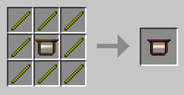

# Blocks

Every block DartCraft adds. Default IDs are in `dartcraft.cfg` and start at 1900.

## Power Ore

| | |
|---|---|
| ID | 1900 |
| Tool | Stone pickaxe or better (harvest level 1) |
| Drops | 2–4 Force Gems per block (Fortune-affected) |
| Worldgen | Overworld, Y ≤ 48: 8 veins/chunk, 4 ore/vein (defaults). Nether: 1.5× the Overworld rate (configurable, clamped 0.25–3.0). |

`generateOre`, `generateNetherOre`, `powerOreFreq`, `powerOreRarity`, `powerOreSpawnHeight`, `netherFreq`, and `regenOre` (auto-regenerate after mining) are configurable.

## Force Infuser

| | |
|---|---|
| ID | 1902 |
| Tool | Stone pickaxe (harvest level 1) |
| Tile entity | `forceInfuser` |
| GUI | 11 inventory slots + animated book |

The centerpiece — applies Force Upgrades to compatible items using **Liquid Force** and **MJ** (BuildCraft).

### Slot layout

| Slot | Purpose |
|---:|---|
| 0 | **Force Tome** (drives tier gating; receives bonus points). |
| 1 | **Liquid input** — Force Gem, Force Shard, Force Bucket, or any Force Container empties into the tank. |
| 2 | **Target** — the tool / armor / pack / rod / tome / upgrade core to infuse. |
| 3–10 | **8 material slots** — upgrade materials (see [force-infusions.md](force-infusions.md)). |

### Storage

| | |
|---|---|
| Liquid Force tank | 10 000 mB |
| MJ buffer | 25 000 MJ |
| MJ draw rate | 5 MJ/T |

### Cost formula

For each infusion attempt, the Infuser sums the **efficiency** of all material slots, then spends:

- **Energy** = 500 MJ × Σefficiency
- **Liquid Force** = 200 mB × Σefficiency
- **Time** = (energy ÷ 5 MJ/T) ticks → 1.0 efficiency = ~5 seconds.

### Notes

- Force Shards in slot 1 give **+10 bonus tome points** each.
- Force Buckets leave an empty vanilla bucket in slot 1.
- If the tome's tier drops below the requirement of a material in slots 3–10, the Infuser **drops** the now-illegal materials out.
- Slot 10 is unlocked only at **Tier 7 (Mastered)** — for the last unique upgrades.
- **Known bug**: The "Go" button calls `MinecraftServer.worldServerForDimension(0)` (hardcoded Overworld) instead of the player's current world — so the Infuser is broken in other dimensions. [UpsilonFixes](upsilonfixes.md) patches this via `fixDartCraftForceInfuserDimension`.

## Force Engine

| | |
|---|---|
| ID | 1907 |
| Tool | Stone pickaxe (harvest level 1) |
| Tile entity | `forceEngine` |
| GUI | 2 liquid slots + tank gauges |

A two-liquid power engine. Outputs MJ on its facing direction.

### Liquid slots

The engine needs **both** a fuel and a throttle to cycle.

**Fuel slot** (bottom):

| Liquid | Burn time (ticks) | Modifier |
|---|---:|---:|
| Liquid Force | 60 000 | 4.0× |
| Lava | 20 000 | 0.5× |
| Oil (BC) | 20 000 | 1.5× |
| Fuel (BC) | 100 000 | 3.0× |
| BioFuel (Forestry) | 40 000 | 2.5× |
| Ethanol (Forestry, "fuel" via biofuel) | — | — |

**Throttle slot** (top):

| Liquid | Burn time (ticks) | Modifier |
|---|---:|---:|
| Water | 600 | 2.0× |
| Ice (liquid) | 20 000 | 4.0× |
| Milk (Forestry) | 3 000 | 2.5× |

The original 0.1.11 post also hints at a "very rare, obscure bee-related liquid" (Honey variant) that **doubles** throttle output compared to water — only reachable through advanced Forestry apiary chains.

### Storage

- 10 000 mB per tank
- 25 000 MJ buffer
- **Max cycle energy: 250 MJ → 10 MJ/t** (hardcoded constant)

> **Known bug — Force Engine throttled below capacity.** The engine can actually produce **up to 400 MJ/cycle (16 MJ/t)**, but `TileEntityForceEngine.transferEnergy()` is hardcoded to cap transfers at 250 MJ. Any production above 10 MJ/t is silently dropped. [UpsilonFixes](upsilonfixes.md) raises the cap via `fixDartCraftForceEngineLimit` — bluedart fixed this properly in the 1.6 version by making the per-cycle cap dynamic.

Each fuel can be disabled in the `fuels` config category.

## Force Trees

| Block | ID | Notes |
|---|---:|---|
| **Force Sapling** | 1906 | Grows into a Force Tree. Bonemeal works. Found as a rare drop from Force Leaves, NOT generated by world-gen. |
| **Force Wood** | 1904 | Two metas: **meta 0 = log**, **meta 1 = plank**. Logs shapeless-craft into **4 planks**. 1 plank → 8 Force Sticks (vertical recipe). Smelting a **plank** gives 2 Golden Power Source (2.0 XP). |
| **Force Leaves** | 1905 | Cyan-tinted leaves. Bonemealing nearby Force Leaves can drop **Force Flax** (a Tear source — handled by `BoneMealHandler`). |

Ore-dict registered: `logWood` (forceLog meta 0), `plankWood` (forceLog meta 1), `treeSapling`, `treeLeaves`.

## Decorative

| Block | ID | Notes |
|---|---:|---|
| **Force Brick** | 1903 | 16 colored variants (one per dye). Crafted from 4× Force Gem + dye-like patterns. Used for Slabs, Stairs, and the unique **Force I** wildcard (Stone Brick + Force = "Force I" brick, used for cheap tome XP farming per the 0.1.11 docs). |
| **Force Slab** | 1908 | Half-block forms of every Force Brick color, plus meta 16 (wood slab). |
| **Force Stairs** | 1901 | Stair forms of every Force Brick color, plus meta 16 (wood stairs). Has its own tile entity (`dartStairEntity`) so the renderer can tint each stair with its meta colour. |
| **Force Frame** | 1909 | Decorative frame block — pure visual. Compatible with BC facades (its texture file becomes the facade material when paired with BC `Builders`). |

### Brick ↔ Slab ↔ Stair conversions

For each color meta `i` (0–15):

- 3× Brick (row) → 6× Slab(i)
- 2× Slab(i) (stacked) → 1 Brick(i)
- Stair pattern (3+2+1) of Brick(i) → 4 Stairs(i)
- 4× Stair(i) (2×2) → 6 Brick(i)

Same conversions apply to Force Wood (meta 16 of slab/stair).

## Force Light

`BlockForceLight.class` is registered in the source tree but **not called by `loadBlocks()`** in 0.1.10 — it's a stub for a glow block that didn't ship. Don't expect to find it via NEI or `/give`.
