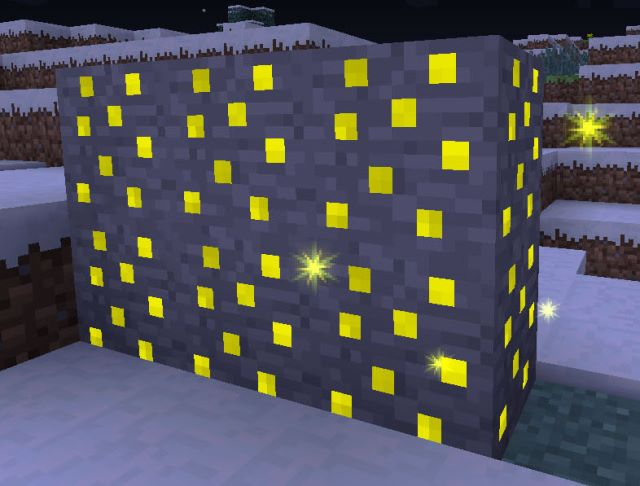
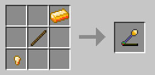
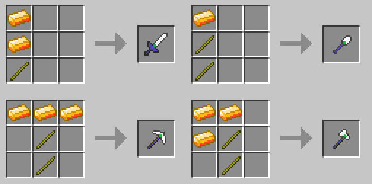

# Getting Started

DartCraft progression is short but opinionated. Here's the path from spawn to a fully infused tool set.

## 1. Find Power Ore



**Power Ore** generates up to Y=48 in the Overworld and throughout the Nether (1.5× the Overworld rate by default). Mine it with a **stone pickaxe** or better. Each block drops **2–4 Force Gems** (Fortune-affected).

Power Ore also appears as:
- **Dungeon loot** in vanilla chests (weight 100, stack 1–8 gems).
- **IC2 Scrapbox drops** at 0.75 %.
- **Macerator output** when you grind it (with IC2).

## 2. Make Force Ingots

You need **Force Ingots** for every Force tool. Routes (in order of accessibility):

- **Vanilla shapeless**: `1 Force Gem + 2 Iron Ingots → 2 Force Ingots`.
- **Ore-dict shapeless** (any one present): Force Gem + 2× Bronze → 2 ingots ; Force Gem + 2× Refined Iron / Silver / Xychoridite → 3 ingots.
- **Forestry Carpenter**: a 1×2 or 2×2 of Iron in 750 mB Liquid Force → 2 ingots (same with Bronze, or 3 ingots with Refined Iron / Silver / Xychoridite).
- **Nugget compression**: 9 Force Nuggets → 1 ingot (and back: 1 ingot → 9 nuggets shapeless).

## 3. Plant a Force Tree (optional but recommended)

Force Saplings are **NOT generated by world-gen**. You get them from:
- **Force Leaves drops** (rare passive drop when leaves decay).
- **Bonemeal a Force Leaves block** — has a chance to drop **Force Flax** (a Tear source). Bonemealing the *sapling* itself just grows the tree like any other.
- **Forestry Arboretum** (Pre-1.5.1 only): Force Trees are slow but pretty.

Trees grow into **Force Wood** with **Force Leaves**. Material flow:

```
1 Force Log (meta 0)  → 4 Force Planks (meta 1)   [shapeless]
2 Force Logs vertical → 8 Force Sticks            [shaped recipe]
1 Force Plank smelted → 2 Golden Power Source    [furnace, 2.0 XP]
```

> **Trap**: the Stick recipe takes **logs**, not planks. If you want to convert planks → sticks you'll need vanilla planks (DartCraft's planks don't have a stick recipe).

## 4. Craft a Force Rod



The Force Rod is a contextual right-click wand — its role grows as you infuse it. Even the un-infused rod is useful: right-click a Force Pack in an item frame to rename it, right-click a Fortune to read it, right-click an Experience Tome to convert it to Upgrade Cores.

```
  I       I = Force Ingot         tier choice:
 S        S = Force Stick OR vanilla stick    (Force Stick → 512 durability,
N         N = Force Nugget                     vanilla stick → 48 durability)
```

## 5. Craft your first Force tools



Standard patterns — replace iron with Force Ingot, vanilla stick with Force Stick:

| Tool | Pattern (rows, top to bottom) |
|---|---|
| Force Sword | `I / I / S` |
| Force Pickaxe | `III / .S. / .S.` |
| Force Shovel | `I / S / S` |
| Force Axe | `II / IS / .S` |
| Force Shears | `F. / .F` (two Force Ingots, diagonal) |
| Force Bow | `.FS / F.S / .FS` (or mirrored) — F = Force Stick, S = String |

See [recipes.md](recipes.md) for the precise grids and ore-dict alternatives.

> Vanilla-enchanting a Force tool (in an Enchanting Table) **locks it out of the Force Infuser permanently**. Pick one path per tool.

## 6. Build a Force Infuser

The infuser is the centerpiece. Place it down and right-click to open the GUI.

### Slot layout

| Slot | Purpose |
|---:|---|
| **0** | Force Tome — drives tier gating, gains points from infusions. |
| **1** | **Liquid input** — Force Gem / Force Shard / Force Bucket / Force Container fills the internal tank. |
| **2** | **Target** — the tool / armor / pack / rod / tome / upgrade core / vanilla item to infuse or transmute. |
| **3–10** | **8 material slots** — upgrade materials. |

Liquid input values:
- Force Gem → 1000 mB
- Force Shard → 1000 mB + **10 bonus tome points** (only if a tome sits in slot 0)
- Force Bucket → 1000 mB (leaves an empty vanilla bucket behind)

> Slot 10 is gated to **Tome Tier 7 (Mastered)** — for Tier-6 unique upgrades.

Power source: BuildCraft MJ — attach any Stirling / Combustion / Force Engine.

> **Bug**: the Infuser's Go button is hard-coded to dimension 0 (Overworld) in 0.1.10/0.1.11. In any other dimension nothing happens when you press Go. [UpsilonFixes](upsilonfixes.md) fixes this via `fixDartCraftForceInfuserDimension`.

## 7. Make a Force Tome

Three routes:

- **Carpenter recipe** (Forestry-required path): `IBI / NPN / IBI` (varies — see recipes).
- **Force Transmutation**: drop a vanilla **Book** into the Infuser's target slot with **no upgrade materials** and a Force Nugget — the book becomes a Force Tome (book is not consumed; you're transmuting it).
- **Dungeon loot**: pre-filled Experience Tomes (1337 XP each) appear in dungeon chests at weight 50.

Without a tome you can still infuse, but every point of Tome XP is **dropped on the floor as an XP orb** instead of accumulating — you'll never reach Tier 2+ that way.

## 8. Infuse — tiers in practice

The tome starts at **Tier 1**. To unlock higher-tier upgrades, accumulate **Force Points**:

| Tome tier | Points required |
|:---:|---:|
| 1 (start) | 0 |
| 2 | 96 |
| 3 | 270 |
| 4 | 600 |
| 5 | 1020 |
| 6 | 1440 |
| 7 (Mastered) | 2400 |

Points per material:

| Material tier | Points each |
|:---:|---:|
| 0 | 1 |
| 1 | 5 |
| 2 | 15 |
| 3, 4 | 25 |
| 5, 6 | 50 |

Plus **+25 bonus** the first time the tome ever sees a given upgrade type, plus per-material bonus (10 pts for Ghast Tears, 10 for Blaze Powder, etc.). A **Force Shard** in slot 1 adds another 10 points each.

> Hold **SHIFT** over a tome to see current points / points-to-next.

### Cheap tome-XP grind

**Stone Brick + Force Nugget** in the Infuser turns the brick into a Force Brick (Force tier 0 wildcard). +1 tome point each, or **+26 the first time you ever apply Force**. Bonus zero cost — Force Nuggets are dirt cheap.

## 9. Power the Infuser

Each infusion's cost scales with the **efficiency** of all materials in slots 3–10:

- **Energy** = 500 MJ × Σefficiency
- **Liquid Force** = 200 mB × Σefficiency
- **Speed** = 5 MJ/T → a 1.0-efficiency infusion takes ~5 seconds

The **Force Engine** is the in-mod power source. Two slots — both must be filled:

| Fuel slot (bottom) | Burn ticks | Modifier |
|---|---:|---:|
| Liquid Force | 60 000 | 4.0× |
| Oil (BC) | 20 000 | 1.5× |
| Fuel (BC) | 100 000 | 3.0× |
| BioFuel (Forestry) | 40 000 | 2.5× |
| Lava | 20 000 | 0.5× |

| Throttle slot (top) | Burn ticks | Modifier |
|---|---:|---:|
| Water | 600 | 2.0× |
| Milk (Forestry) | 3000 | 2.5× |
| Ice (liquid) | 20 000 | 4.0× |

> **Bug**: the Force Engine is capped at 250 MJ/cycle (10 MJ/t) but can produce up to 400 MJ/cycle (16 MJ/t). Energy above 10 MJ/t is wasted. [UpsilonFixes](upsilonfixes.md) fixes this via `fixDartCraftForceEngineLimit`. Without the fix, use 1–2 Combustion Engines for the same effective throughput.

## 10. Sample progression (one Minecraft week)

1. **Day 1** — vanilla iron tools, find Power Ore (Y ≤ 48 around your base).
2. **Day 2** — 1–2 stacks of Force Gems. Craft a Pickaxe + Sword + Shovel + Axe + Shears. Plant Force saplings if you can find any.
3. **Day 3** — build a Force Infuser. Get a Tome (vanilla book + transmute). Force-infuse a Pickaxe with 1 Force Nugget → **Force I**. Cheap, ~+26 points, learns the GUI.
4. **Day 4** — push the tome to Tier 2 (96 pts). Available: **Luck** (Fortune), **Grinding** (flint), **Holding** (glass bottle), **Experience** (bottle o' enchanting).
5. **Day 5** — Tier 3 (270 pts). Unlocks **Touch** (Silk), **Swiftness**, **Healing**. Stack Heat I-IV on the pickaxe for auto-smelt mining.
6. **Day 6** — Tier 4 (600 pts). **Wing** (feather) on a Force Sword for emergency flight ; **Charge** on Force Armor for IC2 EU.
7. **Day 7** — Tier 5+ if you've been farming Force Bricks. **Ender** on the bow makes an Ender Bow ; **Light** on the sword for night raids.
