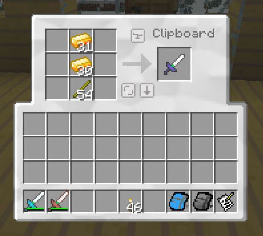
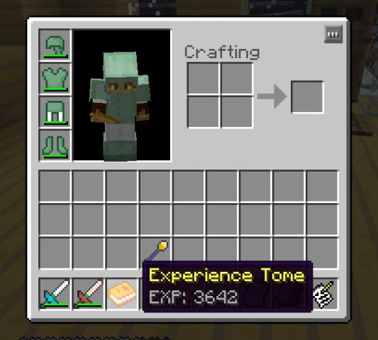

# Items

Every item DartCraft adds, with its default ID and what it does in-game. Default IDs are configurable in `dartcraft.cfg`.

## Resources

| Name | ID | Description |
|---|---:|---|
| **Force Gem** | 6000 | Drop from Power Ore (2–4 per block; Fortune-affected). The base resource. 1 gem in the Infuser tank = 1000 mB Liquid Force. |
| **Force Ingot** | 6001 | Crafted from 1 Force Gem + 2 Iron Ingots (vanilla shapeless). 9 nuggets ↔ 1 ingot. Material for every Force tool and the Infuser. Forestry / IC2 / XYCraft routes use bronze / refined iron / silver / xychoridite for higher yield. |
| **Force Nugget** | 6020 | 9 nuggets ↔ 1 ingot. Cheap **Force** upgrade material (tier 0). |
| **Force Shard** | 6003 | Forestry Squeezer side-product (10% chance from a Force Gem) and dungeon loot. In the Force Infuser's gem slot it fills 1000 mB **and** adds 10 bonus points to the active Upgrade Tome. |
| **Force Stick** | 6022 | 1 Force Plank → 8 sticks. Replaces vanilla sticks in Force tool recipes. |
| **Force Gear** | 6024 | Used in the Force Engine recipe. Substitutes for a Gold Gear in BC's Diamond Gear / Filler / Quarry recipes if BC is installed. Vanilla recipe (no BC) is 4 Force Ingots + 1 Iron Ingot in a + pattern. |
| **Golden Power Source** | 6002 | Output of smelting a Force Plank (forceLog meta 0): **2 per plank**, 2.0 XP. Combined with a stick in the crafting grid yields **6 torches**. Also a **Heat** upgrade material with a +5-point tome bonus. |
| **Inert Core** | 6045 | Built from soul sand + Tears + Claws + (Diamond / Sapphire). Drop it in the world, hit it with a Flint and Steel, then right-click with a Force Rod to spawn a **Bottled Wither** the player can release for a Nether Star. (Vanilla shaped recipe; if Forestry is loaded, the Carpenter recipe with 1 bucket of Liquid Force is preferred / required depending on config.) |
| **Crated Force Gems** | 6027 | Forestry crate of 9 Force Gems. Carpenter and reverse-crafting recipes both registered. |

## Liquids and containers

| Name | ID | Notes |
|---|---:|---|
| **Liquid Force** | 6031 | The mod's fluid. Stored at 1000 mB per container. Used in the Infuser (200 mB × material efficiency per upgrade), the Force Engine (60 000 ticks/bucket at 4.0× modifier), and the Forestry Carpenter (Force Ingot / Inert Core / squeezer recipes). |
| **Force Bucket** | 6032 | Holds 1000 mB Liquid Force. Empties to a vanilla bucket when consumed by the Infuser. |
| **Force Container** | 6033 | Forestry Can / Wax Capsule / Refractory Capsule variants holding Liquid Force (meta 0/1/2). Registered only when Forestry is installed. |
| **Milk Container** | 6034 | Same three variants but for vanilla milk. Forestry only. Three milk containers in a cake-like ring also crafts a vanilla cake (DartCraft adds the recipe). |
| **Entity Bottle** | 6036 | Right-click a mob with a Force Rod (Holding) to bottle it (consumes one Entity Bottle / Force Flask). Right-click on a block to release. Creepers blacklisted by default; Ghasts allowed by default; passive-only mode in config. |

## Food

| Name | ID | Notes |
|---|---:|---|
| **Raw Lambchop** | 6029 | Drops from **vanilla sheep** when killed (DartCraft adds the drop). 3 hunger restored, low saturation. Also Forestry Hunter Backpack loot. |
| **Cooked Lambchop** | 6030 | Smelt the raw one (1.0 XP). 7 hunger, 0.8 saturation. |
| **Fortune Cookie** | 6010 | Shapeless from 1 Cookie + 1 Paper. Eating it spawns a **Fortune** item in the player's inventory. |
| **Fortune** | 6011 | A "fortune" with random text. Reverse-crafts shapelessly into 1 Paper. **Luck** upgrade material (tier 2). 16 Fortunes can also be Force-transmuted back into one Fortune Cookie (uses the rod, doesn't consume the rod). |

## Tools (Force tier — durability 512, enchantability 50)

All Force tools share the same base durability (`Constants.toolDurability = 512`), enchantability (50), and a built-in 0.75× speed modifier on heads (`Constants.speedModifier`). Pick / Drill harvest at **diamond** level (tool class `pickaxe` lvl 3). Axe / Saw harvest at lvl 3 axe.

| Tool | ID | What it does |
|---|---:|---|
| **Force Pickaxe** | 6018 | Diamond-tier pickaxe, infusable. |
| **Force Shovel** | 6021 | Standard shovel, infusable. |
| **Force Axe** | 6023 | Axe, infusable. With **Lumberjack** infusion: instant-fells a vertical wood column at 2× durability per block. |
| **Force Sword** | 6014 | Sword, infusable. Wing turns it into a **Wing Sword** (mid-air flight from any held item — see Force Infusions). |
| **Force Shears** | 6026 | Shears, infusable. Cannot be vanilla-enchanted (it's the only tool in the set with that restriction). |
| **Force Bow** | 6025 | Bow that fires Force Arrows (no drop on impact) or vanilla arrows. Heat-infuse to get a **Heat Bow** (igniting arrows). Ender-infuse to get an **Ender Bow** (teleport-to-impact). |
| **Power Drill** | 6017 | Crafted by Infusing an IC2 Mining Drill or Diamond Drill with a Force Nugget (Force upgrade). **Socketable** (Upgrade Cores), uses IC2 EU. The Diamond Drill variant flings its diamonds out as drops on infusion. IC2 required. |
| **Power Saw** | 6016 | Same, but from an IC2 Chainsaw. Socketable, IC2 EU. |
| **Heat Bow** | 6037 | Auto-replaces Force Bow on Heat infusion. Same stats + Fire arrows. |
| **Ender Bow** | 6040 | Auto-replaces Force Bow on Ender infusion. Same stats + teleport on hit. |

> **Caveat from the 0.1.11 docs**: Vanilla-enchanting a Force Tool (in a vanilla Enchanting Table) **locks it out of the Force Infuser permanently**. Pick one path per tool.

## Armor (Force set)

A complete 4-piece set. Damage reduction is comparable to diamond. The set has **no built-in special** — every behavior comes from sockets and the three Infuser-only upgrades (Camo / Charge / Charge2).

| Piece | ID |
|---|---:|
| **Force Cap** | 6005 |
| **Force Tunic** | 6006 |
| **Force Pants** | 6007 |
| **Force Boots** | 6008 |

Force Armor is **socketable**: stuff an **Upgrade Core** into it via the Socket GUI. Sockets recognise Force / Damage / Heat / Speed / Lumberjack / Luck / Grinding / Holding / Touch / Wing / Sturdy. The Infuser additionally accepts **Camo** (invisible-render), **Charge** (IC2 EU buffer), and **Charge2** (bigger buffer) directly on armor. **Once Infuser-upgraded a piece cannot enter the Infuser again** — but sockets remain editable.

### Notable socket effects

| Socket | Effect |
|---|---|
| **Wing** (any piece) | +100 % Wing Meter per piece. Full set → 5× max meter. Holding Shift+Space+RightClick with empty hands initiates flight. Full Wing set flight ≈ 40 s. |
| **Sturdy** | Damage reduction from all sources. Max Sturdy on every piece ≈ 75 % damage reduction (rounded to half-hearts). |
| **Force** (3+ pieces) | "Minecraft Monk": punch un-tooled blocks bare-handed, +50 % tool efficiency, slight knockback in look direction, ambient *thwack* sound, negates Wing flight's efficiency penalty. Each "monk-punch" damages the armor when you exceed the hand's normal tier. |
| **Healing** | Passive Regeneration ticks. |
| **Swiftness** | Speed potion effect. |
| **Ender** | Teleport on use. |

## Storage

| Item | ID | What |
|---|---:|---|
| **Force Pack** | 6012 | Backpack. Starts at **Config.packSize** slots (default 8, max 40, multiples of 8). Right-click to open. Each **Holding** infusion adds +8 slots. Can be **renamed via the Force Rod** (one of its right-click actions). |
| **Ender Pack** | 6028 | Force Pack variant whose inventory is your **Ender Chest** contents. Holding upgrade is **incompatible** with Ender — pick one. EnderStorage integration sits on top. |
| **Clipboard** | 6004 | Portable 3×3 crafting grid (`Clipboard` GUI). Recipe is `PIP / PpP / PpP` with paper, iron and piston. |

## Books and progression

| Item | ID | What |
|---|---:|---|
| **Force Tome** | 6013 | The progression book. Three internal types: **Upgrade Tome** (`type=0`, default), **Craft Tome** (`type=1`, used by recipes internally), **Experience Tome** (`type=2`). |
| **Force Rod** | 6015 | Multi-tool / wand. Two craft tiers: vanilla stick handle → 48 durability ; Force Stick handle → 512 durability. Can be infused with **one** upgrade per rod to become Rod of Speed / Healing / Holding / Return / Heat. |
| **Upgrade Core** | 6019 | Single-type upgrade module. Infuse once with one upgrade (it may stack to max level), then socket it into a Force Armor piece or Power Tool. Once socketed it's permanent unless you shift-right-click to **destroy** it (frees the socket but loses the core). |

### Tome types in detail

- **Upgrade Tome** — tracks **Force Points**. Required in the Infuser to climb tiers. Tome tier is shown in blue. SHIFT-hover the tome to see current points + points-to-next.
- **Experience Tome** — stores XP. **Sneak + right-click** deposits 10 XP per click (loops). Right-click withdraws. A dungeon-loot variant is pre-filled with 1337 XP. An Experience Tome can be **converted into Upgrade Cores** with the Force Rod (destroying the tome, 1 core per 50 stored XP).
- **Craft Tome** — internal use; not user-facing in 0.1.10/0.1.11.

### Force Rod actions

The Force Rod is a contextual right-click wand. What it does depends on what it's pointing at:

| Right-click target | Effect |
|---|---|
| An entity (rod has **Holding**, Force Flask in inventory, ≤16 blocks) | Bottles that entity into the flask. |
| A **Force Tome** (any) | Inspect tome state (also via SHIFT-hover). |
| A **Bottled Wither** (Inert Core ignited) | Releases the wither. |
| A **Force Pack** held by an **Item Frame** | Renames the pack via the Rename GUI. |
| A **Fortune** item | Read the fortune text. |
| An **Experience Tome** | Convert to Upgrade Cores (destroys the tome). |
| An entity with rod Infusions matching the target's tags | Tool-specific effect (e.g. Punish / Tear / etc.). |
| Self (empty hands required for Wing) | Engage flight while wearing Wing-socketed armor. |

## Misc / drops

| Item | ID | Source |
|---|---:|---|
| **Claw** | 6044 | Drop from hostile mobs (zombies, skeletons, spiders) — DartCraft adds the drop. **Bats also drop claws** in 0.1.11. Used in **Damage** infusions and in the Inert Core recipe. |
| **Tear** | 6043 | Drop from Force Flax (bonemealed Force Leaves) and passive mobs. Tier-3 **Healing** material. Also part of the Inert Core recipe. |
| **Force Arrow** | 6009 | Arrow with bonus damage that **does not drop on impact**. Recipe: 1 Nugget + 1 Stick + 1 Feather → 6 arrows. |
| **Force Flask** *(0.1.11 only)* | — | Glass + Force Nugget. The **Holding** upgrade material in 0.1.11 (replaces the simple Glass Bottle from earlier builds). Force Flasks are also the *reagent* the rod consumes when bottling entities — without one in your inventory, Holding rod does nothing. |

## Force Transmutations

A Force Transmutation is a 1-input → 1-output recipe applied by **the Force Infuser** (the input goes into slot 2 — the target slot — with **no upgrade materials**, just power + a tiny amount of liquid). The mod registers these by default:

| Input | Output | Stack | Input consumed |
|---|---|---:|:---:|
| Book | Force Tome (Upgrade Tome) | 1 | ✗ (book stays, used as reagent) |
| Iron Helmet | Force Cap | 1 | ✓ |
| Iron Chest | Force Tunic | 1 | ✓ |
| Iron Pants | Force Pants | 1 | ✓ |
| Iron Boots | Force Boots | 1 | ✓ |
| Fortune Cookie | Fortune | 16 | ✗ |

With **Forestry**: bronze tools/armor → 2–8 bronze ingots (sword=2, pick=3, shovel=1, axe=3, hoe=2, helm=5, chest=8, legs=7, boots=4). With **Railcraft**: same for steel. With **Thaumcraft**: thaumium tools/armor → equivalent thaumium ingot counts (specifically to mitigate the prolifery of Thaumium Hoes and Axes in dungeons).

## Items added only in 0.1.11 (not in the 1.4.7 build)

| Item | What | 0.1.11 only? |
|---|---|---|
| **Force Flask** | Replacement for Glass Bottle as the Holding material; the rod consumes one per entity bottled. | Yes |
| **Camo** Upgrade Material | A potion of invisibility (any iteration) | Yes |
| **Charge2** Upgrade Material | IC2 Energy Crystal | Yes |

The 0.1.10 build uses Glass Bottle + Ender Pearl directly for these tiers; the rest of the tool/armor list is identical between builds.
