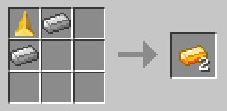
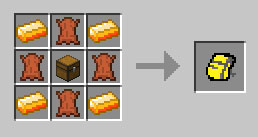
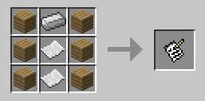
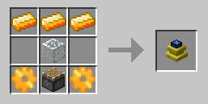

# Recipes

All crafting / smelting / machine recipes registered by DartCraft. Some are conditional on which mods are installed — those sections are flagged.

Legend: `I` = Force Ingot, `S` = Force Stick (Force tool recipes) or String (Cobweb), `G` = Force Gem (or Glass — context-dependent), `N` = Force Nugget, `F` = Feather (arrow) or Force Stick (bow), `R` = Redstone, `P` = Paper, `.` = empty slot.

## Core resources

### Force Ingot



```
shapeless: 1 Force Gem + 2 Iron Ingot       →  2 Force Ingot
shaped:    NNN / NNN / NNN  (Force Nugget)  →  1 Force Ingot
shapeless: 1 Force Ingot                    →  9 Force Nugget
```

With Forestry / IC2 ore-dict (shapeless via `ShapelessOreRecipe`):

```
1 Force Gem + 2 ingotBronze          →  2 Force Ingot
1 Force Gem + 2 ingotRefinedIron     →  3 Force Ingot
1 Force Gem + 2 ingotSilver          →  3 Force Ingot
1 Force Gem + 2 xychorididte (any)   →  3 Force Ingot   (only if XYCraft is loaded)
```

### Force Sticks

```
W       (1 Force Log meta 0, i.e. raw log)       →  8 Force Sticks
W
```

> Note: the stick recipe takes **2 logs vertically**, not planks. Logs → planks separately: shapeless `1 Force Log → 4 Force Planks`.

### Golden Power Source

Furnace: `1 Force Plank (forceLog meta 0) → 2 Golden Power Source` (2.0 XP). Used in:

```
G   →  6 Torches   (G = Golden Power Source, S = vanilla stick)
S
```

## Force Tools


```
Force Pickaxe        Force Sword        Force Shovel
 III                  I                  I
  S                   I                  S
  S                   S                  S

Force Axe            Force Shears
 I I                  F .
 I S                  . F
   S
```

```
Force Bow (either mirror is registered)         Force Arrow (×6)
 F S         S F                                 N
F   S   or  S   F                                S
 F S         S F                                 F  (F = Feather)
```

In the Force Bow recipe, `F` = Force Stick, `S` = vanilla String.

## Force Rod


Two tiers — same pattern, different handle:

```
  I       (vanilla Stick handle → 48 durability)
 S
N

  I       (Force Stick handle → 512 durability)
 S
N
```

## Containers and decoration

### Force Pack



```
ILI    L = Leather
LCL    I = Force Ingot
ILI    C = Chest
```

### Clipboard



```
PIP    P = Paper        I = Iron Ingot
PpP    p = Piston
PpP
```

### Force Brick → Slab / Stairs

For each color metadata `i` ∈ 0..15:

```
BBB           →  6 Slab(i)
                                  (B = Force Brick of color i)
S             →  1 Brick(i)
S             (S = Slab(i))

B..           →  4 Stair(i)
BB.
BBB

SS            →  6 Brick(i)
SS            (S = Stair(i))
```

For wood variants (slab meta 16, stair meta 16):
- 3× Force Wood plank (forceLog meta 1) → 6× wood-slab.
- 1×2 wood slab → 1 plank.
- Stair pattern (3+2+1) of planks → 4 wood stairs.
- 2×2 wood stairs → 6 planks.

## Force Engine



```
Force Gear (only if no BuildCraft installed)   Force Engine
 F                                              III
FIF   (F = Force Ingot, I = vanilla Iron)       .G.
 F                                              FPF
                                                
                                                I = Force Ingot
                                                G = Glass
                                                F = Force Gear
                                                P = Piston
```

DartCraft also auto-registers a **vanilla Piston recipe** alternative so you can always craft a piston without iron, only Force Ingot:

```
PPP     P = Plank
CIC     C = Cobblestone
CRC     I = Force Ingot
        R = Redstone
```

## Inert Core (Nether Star alternative)

Only registered if you don't have Forestry, or if `netherStarRecipe = true` (default) in the upgrades config category.

```
STS     S = Soul Sand
CDC     T = "itemTear"  (DartCraft Tear or any ore-dict source)
STS     C = "itemClaw"  (DartCraft Claw or any ore-dict source)
        D = Diamond  (one recipe registered)
        D = Sapphire (separate recipe registered if "gemSapphire" is in the ore-dict)
```

Drop the resulting Inert Core in the world, hit it with a Flint and Steel, then right-click with a Force Rod to spawn a Bottled Wither.

## Vanilla recipe additions

DartCraft adds these workbench recipes that work even in a stock setup:

```
Cobweb           Bottle o' Enchanting   Vanilla Piston (alt)
S S              G                       PPP
 S               R                       CIC
S S              B                       CRC

S = String       G = Glowstone Dust      P = Plank
                 R = Redstone            C = Cobblestone
                 B = Glass Bottle        I = Force Ingot
                                         R = Redstone
```

## Smelting

| Input | Output | XP |
|---|---|---:|
| Raw Lambchop | Cooked Lambchop | 1.0 |
| Force Log (meta 0 — raw log) | 2× Golden Power Source | 2.0 |

## Fortune Cookie

```
shapeless: Cookie + Paper       →  1 Fortune Cookie
shapeless: 1 Fortune            →  1 Paper
```

## Cake recipe (Milk Container variant)

For each Milk Container meta (i ∈ 0..2), DartCraft adds:

```
MMM     M = Milk Container (the matching meta)
SES     S = Sugar
WWW     E = Egg
        W = Wheat
```

## Forestry integration

### Carpenter Manager

| Time | Liquid | Box | Output | Pattern |
|---:|---|---|---|---|
| 20 | 1000 mB Liquid Force | — | Inert Core | `STS / CDC / STS` (S = Soul Sand, T = Tear (ore-dict), C = Claw (ore-dict), D = Diamond *or* `gemSapphire`) |
| 10 | 750 mB Liquid Force | — | 2 Force Ingot | `II / II` or `I / I` (I = Iron) |
| 10 | 750 mB Liquid Force | — | 2 Force Ingot | same with Bronze |
| 10 | 750 mB Liquid Force | — | 3 Force Ingot | same with Refined Iron / Silver / Xychoridite |
| 5 | 100 mB Water | Forestry Crate | Crated Nikolite | 3×3 Nikolite dust *(if `populateCrates` and a Nikolite OreDict entry exist)* |
| 5 | 100 mB Water | Forestry Crate | Crated Brass | 3×3 Brass ingot *(same condition)* |
| 5 | 100 mB Water | Forestry Crate | Crated UU-Matter | 3×3 UU-Matter *(IC2 also loaded)* |
| — | (proven frame recipe) | — | Forestry Proven Frame | `SSS / SFS / SSS` (S = Force Stick, F = Impregnated Frame) |
| — | — | — | Crated Force Gems | 9 Force Gem (and inverse) |

### Squeezer Manager

| Time | Inputs | Liquid | Side output | Chance |
|---:|---|---|---|---:|
| 8 | 1 Force Gem | 1500 mB Liquid Force | Force Shard | 10 % |
| 5 | 1 Force Container (any of meta 0–2) | 1000 mB Liquid Force | — | — |
| 8 | 1 Force Log | 100 mB Liquid Force | — | — |

### Fermenter Manager

| Input | Time | Modifier | Output |
|---|---:|---:|---|
| Force Sapling | 2000 ticks | 0.5× | Biomass |

## IC2 integration

| Recipe | Output |
|---|---|
| Macerate any `oreLead` | 2× Lead Dust (whatever `dustLead` is first in OreDict) |
| Macerate any `oreTungsten` | 2× Diamond (EE2 throwback) |
| Macerate any colored wool | 1× String (fills in IC2's missing colors) |
| 8× Redstone + 1× Ruby | 1 Energy Crystal (alt for diamonds) |
| 3 Refined Iron + 3 Force Ingot + 3 Tin Ingot | 4 Mixed Metal Ingot (vs the vanilla IC2 recipe of 2) |
| 3 UU-Matter (NE corner pattern) | 8 Force Gem |
| 5 UU-Matter (corner pattern) | 1 Lapis Block |
| 5 UU-Matter (T pattern) | 1 Eye of Ender |
| Electronic Circuit + Force Ingot + Cable + Redstone | 2 Electronic Circuits (cheaper recipe) |
| Scrapbox drops | Force Shard (2.0 %) · Power Ore (0.75 %) · Force Gem (0.85 %) · Forestry capsules / cans (1.5 %) · Paper (2.5 %) |

Smelting fix: 1 Silver Dust → 1 Silver Ingot (forces the result count to 1 in case another mod sets it higher).

### IC2 tool upgrades

Putting an IC2 tool in the **Force Infuser** with a Force Nugget upgrades it:

| Input tool | Result | Notes |
|---|---|---|
| Mining Drill | Power Drill | Socketable. |
| Diamond Drill | Power Drill | Same, but flings the original diamonds back into the world. |
| Chainsaw | Power Saw | Socketable. |

## Thermal Expansion integration

| Machine | Time | Input | Output | Side |
|---|---:|---|---|---|
| Sawmill | 200 | 1 Force Log | 6 Force Planks | + Sawdust |

(The Grinding upgrade uses TE's Pulverizer / Sawmill at runtime — see [force-infusions.md](force-infusions.md).)

## Liquid registrations

| Liquid | Volume | Container ↔ Empty |
|---|---|---|
| Liquid Force | 1000 mB | Force Bucket ↔ Vanilla Bucket |
| Liquid Force | 1000 mB | Force Can (Forestry) ↔ Empty Can |
| Liquid Force | 1000 mB | Wax Capsule (Forestry) ↔ Empty Wax Capsule |
| Liquid Force | 1000 mB | Refractory Capsule (Forestry) ↔ Empty Refractory |
| Milk | 1000 mB | Milk Can / Capsule (Forestry) ↔ matching empties |

Liquid Force is registered in the **Forge LiquidDictionary** as `liquidForce`.

## Force Transmutations (via Force Infuser)

See [items.md → Force Transmutations](items.md#force-transmutations) for the input → output table. Transmutations go through the Infuser's target slot with **no upgrade materials** in the side slots — just power + a tiny amount of Liquid Force.
